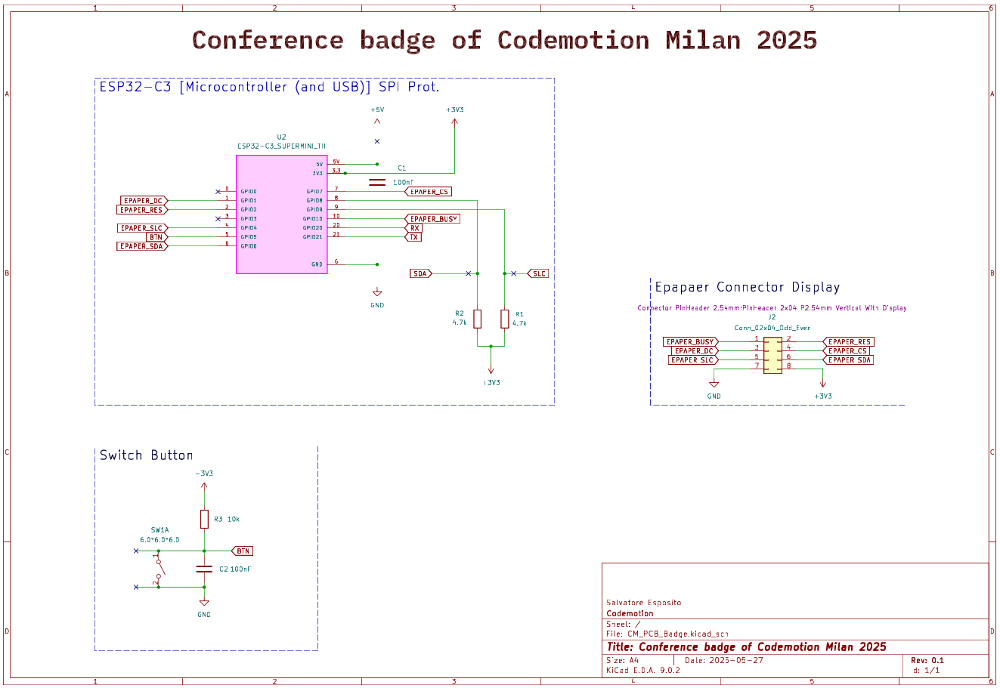
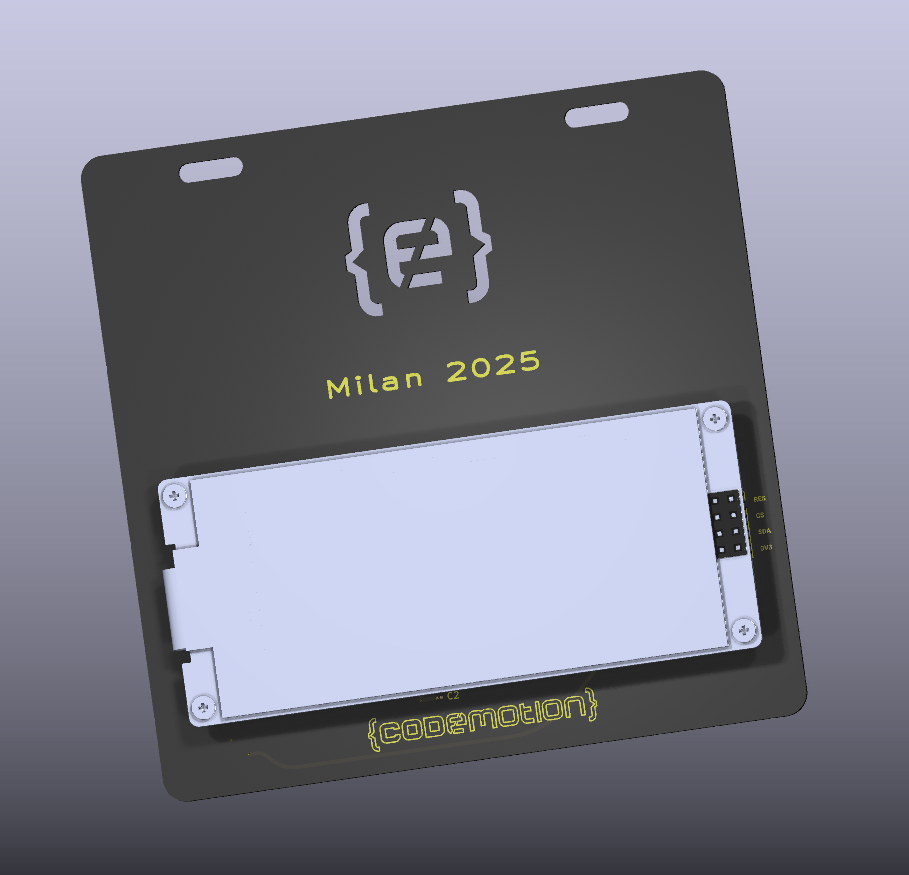
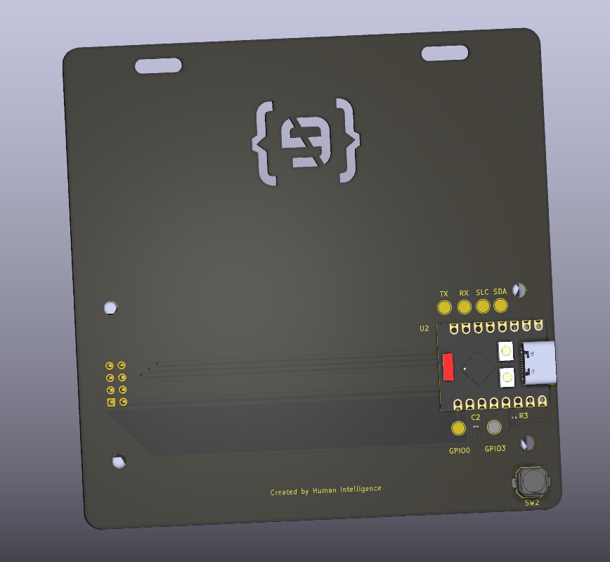

# 🏷️ Smart Badge Elettronico per Eventi

Badge elettronico basato su ESP32 e display e-paper per eventi Codemotion.  
Visualizza **nome, cognome, job title, company** e **QR code personalizzato** sincronizzato direttamente con l’app di check-in.

## ✨ Funzionalità principali

- ✅ Display e-paper ultra low power
- ✅ Sincronizzazione diretta con l’app check-in
- ✅ Programmazione via USB-C
- ✅ QR code personalizzato
- ✅ Completamente passivo durante l'evento
- ✅ Riutilizzabile e sostenibile

## 🖥️ Hardware

- **ESP32 Super Mini**
- **Display e-paper** Waveshare 2.9" b/n 3C
- **Porta USB-C** per alimentazione e programmazione

## 🔌 Schema hardware



```
- ESP32 GPIO -> Display e-paper SPI
- USB-C -> 5V + Programmazione
- Pulsante -> GPIO 5 (opzionale per future funzioni)
```

## 📷 Render e prototipi

### Render PCB




### Foto prototipo reale


## 🛠️ Build & Flash firmware

### Requisiti

- PlatformIO (consigliato) o Arduino IDE
- Librerie:
    - GxEPD2_3C
    - U8g2_for_Adafruit_GFX
    - QRCodeGFX

### Build

```bash
# Clona il progetto
git clone https://github.com/tuo-username/tuo-repo.git
cd tuo-repo

# Build e flash con PlatformIO
pio run --target upload
```

### Struttura del firmware

```
// Configurazione
#define ENABLE_GxEPD2_GFX 0
#define QRCODE_VERSION 3

// PIN Definitions
const int DISPLAY_SCK_PIN = 4;
const int DISPLAY_MOSI_PIN = 6;
const int DISPLAY_DC_PIN = 1;
const int DISPLAY_CS_PIN = 7;
const int DISPLAY_BUSY_PIN = 3;
const int DISPLAY_RES_PIN = 2;
const int BUTTON_PIN = 5;

// Librerie
#include <Arduino.h>
#include <GxEPD2_3C.h>
#include <U8g2_for_Adafruit_GFX.h>
#include <QRCodeGFX.h>

// Struttura dati
struct BadgeData {
  String name;
  String surname;
  String jobTitle;
  String company;
  String qrLink;
};

// Componenti globali
GxEPD2_3C<GxEPD2_290_C90c, GxEPD2_290_C90c::HEIGHT> display(...);
U8G2_FOR_ADAFRUIT_GFX u8g2_for_adafruit_gfx;
QRCodeGFX qrcode(display);
BadgeData currentData; 
```

### Funzioni principali

- **drawBadge()**: disegna il badge completo sul display
- **drawQr()**: genera e disegna il QR code
- **parseAndLoadBadgeData()**: riceve i dati da seriale e aggiorna il badge
- **checkSerialInput()**: ascolta la seriale per eventuali aggiornamenti

## 🚀 Roadmap

- [x] Prototipo funzionante
- [x] Sincronizzazione app check-in
- [x] Produzione primi 5 esemplari
- [ ] Supporto OTA wireless
- [ ] Personalizzazione template grafico
- [ ] Supporto multi-evento

## 📦 Costi di produzione

- 5 esemplari prodotti via PCBWay (~20 USD cad.)
- Costi stimati in produzione in volume (100-300 unità): ~10 USD cad.

## 🤝 Contributi

PR e idee sono benvenuti! 🚀

## Licenza

MIT License.

### Link alla presentazione

https://www.canva.com/design/DAGpyELCSFQ/qBx6hwTSARdgQ4nmrtGfRQ/edit?utm_content=DAGpyELCSFQ&utm_campaign=designshare&utm_medium=link2&utm_source=sharebutton
