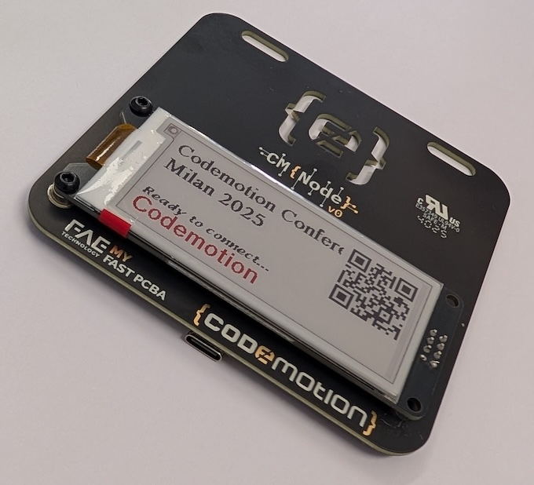
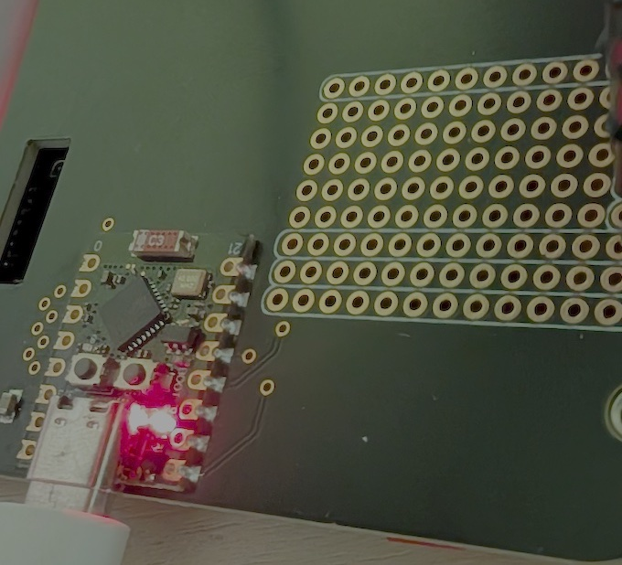
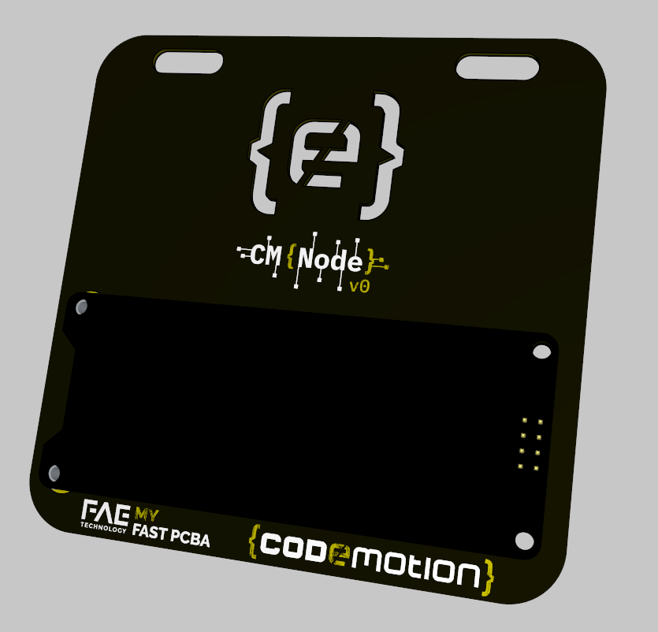
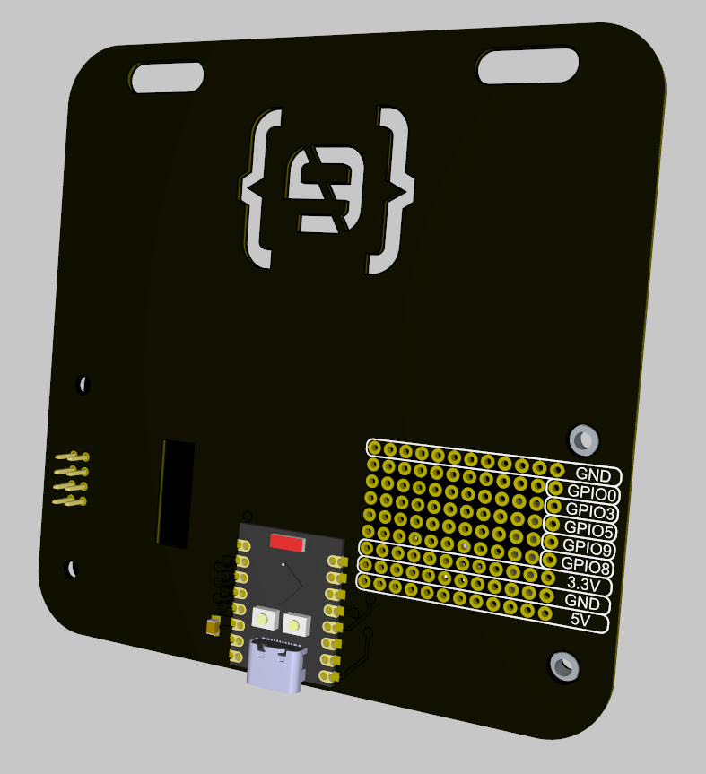
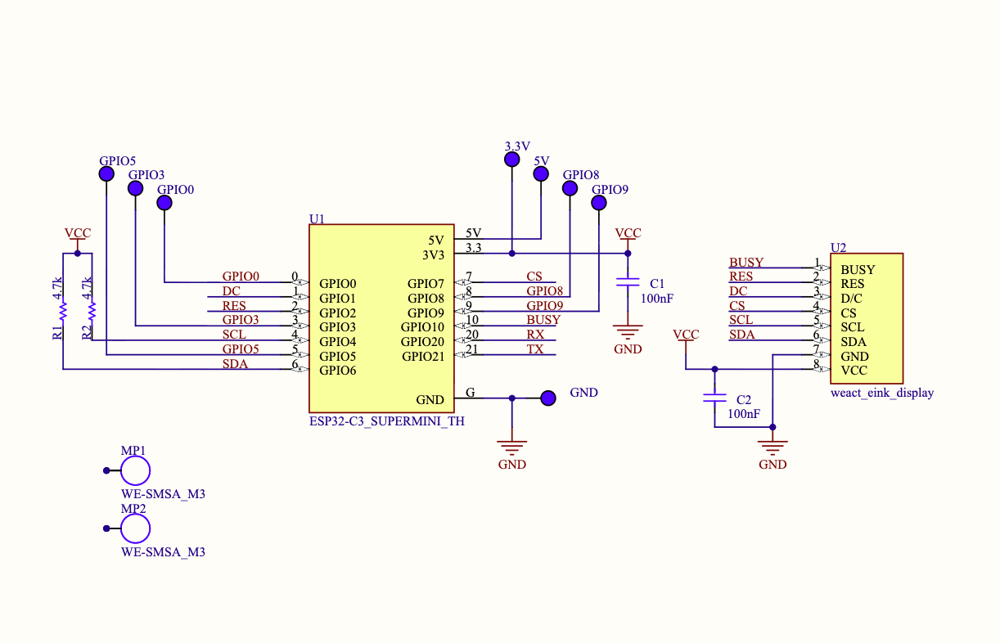

<div align="center">

# CMNode v0

### The Open Hardware Badge by Codemotion

[](https://opensource.org/licenses/MIT)
[](https://platformio.org/)
[](https://www.arduino.cc/)
[](https://www.espressif.com/)
[](https://www.cmnode.it/)

---

> *An open-source electronic badge for developers who want to compile their own solutions.*


**[cmnode.it](https://www.cmnode.it/)** · [Report a Bug](https://github.com/Codemotion-Official/CMNode/issues) · [Request Feature](https://github.com/Codemotion-Official/CMNode/issues)

</div>

---

## What is CMNode?

CMNode v0 is Codemotion's official **open-source hardware badge** — a programmable, reusable conference badge built for developers who want to push beyond just wearing a name tag. Powered by an ESP32-C3 (RISC-V architecture) and a 2.9" tri-color e-paper display, it shows your **name, role, company**, and a **personalized QR code** synced directly with the check-in system.

This is not disposable conference swag. It's a developer tool in badge form.

<div align="center">
  <table border="0" cellspacing="0" cellpadding="0"><tr>
    <td></td>
    <td></td>
  </tr></table>
</div>

---

## Renders & Prototype

<div align="center">

| Front | Back | Prototype |
|-------|------|-----------|
|  |  |  |

</div>

---

## Hardware

| Component | Details |
|-----------|---------|
| **MCU** | ESP32-C3 Super Mini (RISC-V, WiFi, BLE) |
| **Display** | WeAct 2.9" E-Paper — Black / White / Red (`GxEPD2_290_C90c`) |
| **Connectivity** | USB-C (power + programming) |
| **Prototyping** | Full GPIO breakout with breadboard area |

Full parts list: [`bom/Parts_BOM.csv`](bom/Parts_BOM.csv)

### Pin Configuration (ESP32-C3)

```
EPD_CS   → GPIO 7
EPD_DC   → GPIO 1
EPD_RST  → GPIO 2
EPD_BUSY → GPIO 10
SCK      → GPIO 4  (hardware SPI default)
MOSI     → GPIO 6  (hardware SPI default)
```




---

## Firmware

The firmware is available in **two flavors** — choose the one that fits your workflow.

### Option A — PlatformIO (Recommended)

Best for VS Code users. Handles library management, compilation, flashing, and serial monitoring automatically.

**Requirements:**
- [VS Code](https://code.visualstudio.com/) + [PlatformIO extension](https://platformio.org/platformio-ide)
- Or PlatformIO CLI

```bash
# Clone the repository
git clone https://github.com/Codemotion-Official/CMNode.git
cd CMNode

# Build and flash
pio run -t upload

# Open serial monitor
pio device monitor
```

The entry point is **`src/main.cpp`**. Libraries are defined in `platformio.ini` and installed automatically:

```ini
[env:esp32c3_supermini]
platform    = espressif32
board       = esp32-c3-devkitm-1
framework   = arduino
upload_speed = 115200

lib_deps =
    adafruit/Adafruit GFX Library
    adafruit/Adafruit BusIO
    https://github.com/ZinggJM/GxEPD2.git
    olikraus/U8g2_for_Adafruit_GFX@^1.8.0
    wallysalami/QRCodeGFX@^1.0.0
```

---

### Option B — Arduino IDE

Prefer a visual interface? Open **`NodeV0.ino`** directly in the Arduino IDE.

**Requirements:**
- [Arduino IDE 2.x](https://www.arduino.cc/en/software)
- ESP32 board support (via Board Manager → add `https://raw.githubusercontent.com/espressif/arduino-esp32/gh-pages/package_esp32_index.json`)
- Install these libraries via **Library Manager**:

| Library | Author |
|---------|--------|
| `GxEPD2` | ZinggJM |
| `Adafruit GFX Library` | Adafruit |
| `Adafruit BusIO` | Adafruit |
| `U8g2_for_Adafruit_GFX` | olikraus |
| `QRCodeGFX` | wallysalami |

Select board: **ESP32C3 Dev Module** — then upload as usual.

---

## How It Works

### Data Structure

```cpp
struct BadgeData {
  String name;      // First name
  String surname;   // Last name
  String role;      // Job title
  String company;   // Company name
  String qrLink;    // URL encoded in the QR code
};
```

### Serial Protocol

The badge listens on the serial port at **9600 baud**. Send a single line in this format to update the display in real time:

```
Name;Surname;Role;Company;QRLink\n
```

**Example:**
```
Ada;Lovelace;Software Engineer;Codemotion;https://codemotion.com/profile/ada
```

The badge will parse the input, render the updated layout, and put the display into hibernate mode to save power.

### Rendering Pipeline

```
parseSerialData()
       │
       ▼
   badge struct updated
       │
       ▼
  refreshDisplay()
       │
       ├── display.setFullWindow()
       ├── display.firstPage()
       │       └── drawContent()
       │               ├── Name & Surname (u8g2 font)
       │               ├── Role (smaller font)
       │               ├── Company (red, bold)
       │               └── QR Code (right-aligned)
       └── display.hibernate()
```

---

## Project Structure

```
CMNode/
├── src/
│   └── main.cpp          # PlatformIO entry point
├── NodeV0.ino            # Arduino IDE entry point (same logic)
├── platformio.ini        # PlatformIO configuration
├── include/              # Header files
├── lib/                  # Local libraries
├── test/                 # Test files
├── bom/
│   └── Parts_BOM.csv     # Bill of Materials
└── images/
    ├── render_front.png
    ├── render_back.png
    ├── prototype_photo.png
    ├── PCB.png
    └── SCH.png
```

---

## Contributing

CMNode is open to the entire Codemotion developer community. Whether you want to improve the firmware, design a new badge layout, build a companion app, or just share ideas — you are welcome here.

**Ways to contribute:**
- Open an [Issue](https://github.com/Codemotion-Official/CMNode/issues) to report bugs or suggest features
- Submit a Pull Request with your improvements
- Share your custom badge layout or firmware extension
- Join the conversation on the **Codemotion Discord**

Please follow the standard [GitHub flow](https://docs.github.com/en/get-started/using-github/github-flow): fork → branch → PR.

---

## License

Distributed under the **MIT License**. See [`LICENSE`](LICENSE) for details.

---

<div align="center">

Made with ♥ by the **Codemotion** team and community.

[](https://www.cmnode.it/)

</div>
